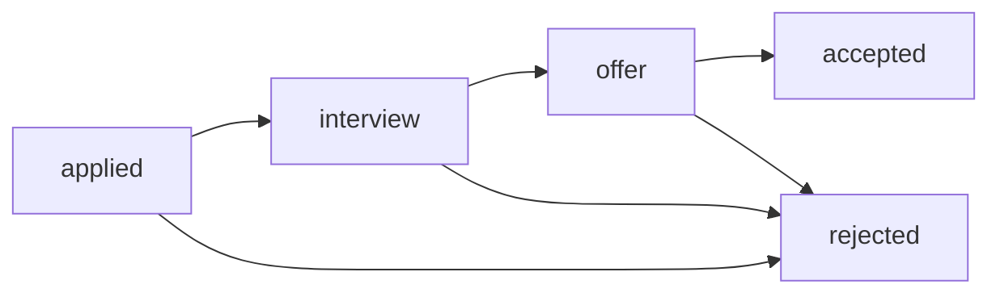

# Candidature Tracking Implementation Guide

## Endpoints

- GET /api/candidatures
- POST /api/candidatures
- PATCH /api/candidatures/{id}
- GET /api/savedOpportunities
- POST /api/savedOpportunities
- DELETE /api/savedOpportunities/{id}

## Authorization Matrix

| Endpoint | ROLE_STUDENT | ROLE_COMPANY | ROLE_ADMIN |
|---|---|---|---|
| GET /api/candidatures | Own only | Own opportunities only | All |
| POST /api/candidatures | Own only | Forbidden | Forbidden |
| PATCH /api/candidatures/{id} | Forbidden | Own opportunities only | All |
| GET /api/savedOpportunities | Own only | Forbidden | All |
| POST /api/savedOpportunities | Own only | Forbidden | All |
| DELETE /api/savedOpportunities/{id} | Own only | Forbidden | All |

## Status Transition Rules



Terminal statuses: accepted, rejected.

## Error Response Format

```json
{
  "@context": "/api/contexts/Error",
  "@type": "hydra:Error",
  "hydra:title": "Error title",
  "hydra:description": "Detailed message"
}
```

## Error Scenarios Guide

- 400: missing required IDs, invalid date format, invalid status transition
- 401: missing/invalid JWT
- 403: authenticated user lacks role/scope
- 404: target candidature/saved item not found
- 409: duplicate candidature for (opportunity, student)

## Frontend Integration Notes

- Use ISO 8601 UTC timestamps.
- `savedOpportunities` POST is idempotent: submit freely, treat 200 and 201 as success.
- For candidature status updates, pre-validate transitions in UI to reduce round-trips.
- Read nested `opportunity` and `student` objects from each item to avoid extra lookups.
- Use `hydra:view` links for pagination controls.

## Fixtures

See [var/share/candidature-fixtures.sql](../var/share/candidature-fixtures.sql) for sample data seed script.
